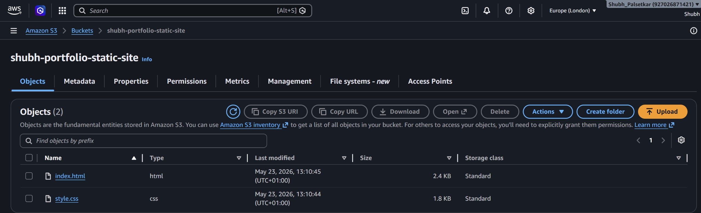
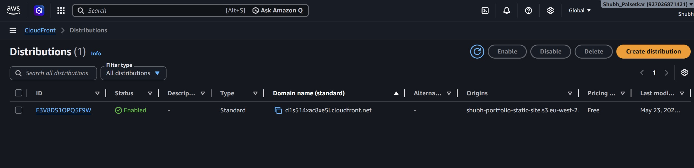
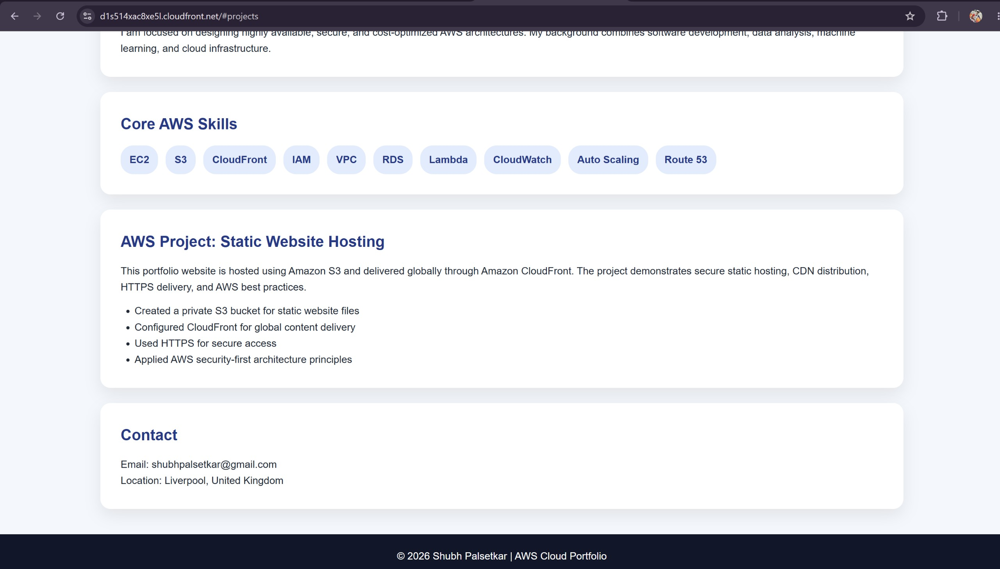

# AWS Static Website Hosting using Amazon S3 + CloudFront

## Project Overview

This project demonstrates how to deploy a secure and globally distributed static website using AWS cloud services.

The website is hosted privately in Amazon S3 and delivered securely worldwide using Amazon CloudFront.

## Architecture


Architecture Flow:

User → CloudFront CDN → Private S3 Bucket

Services used:

- Amazon S3
- Amazon CloudFront
- HTTPS
- Origin Access Control (OAC)
- Static Website Hosting

---

## AWS Services Used

### Amazon S3
- Private bucket storage
- Static website assets hosting
- Secure object management

### Amazon CloudFront
- Global CDN delivery
- HTTPS support
- Edge caching
- Low latency distribution

### Security

- S3 bucket kept private
- CloudFront granted secure bucket access
- HTTPS enforced
- AWS security best practices followed

---

## Deployment Steps

1. Created private S3 bucket
2. Uploaded HTML and CSS files
3. Configured CloudFront distribution
4. Enabled Origin Access Control
5. Restricted direct bucket access
6. Deployed globally through CloudFront

---

## Screenshots

### S3 Bucket



### CloudFront Distribution



### Live Website




---

## Repository Structure

```

aws-static-website-cloudfront/
│
├── architecture/
│ └── architecture-diagram.png
│
├── screenshots/
│ ├── s3-bucket.jpeg
│ ├── cloudfront-distribution.jpeg
│ ├── website-live1.jpeg
│ └── website-live2.jpeg
│
├── index.html
├── style.css
└── README.md

```

---

## Skills Demonstrated

AWS S3 • CloudFront • CDN • Static Website Hosting • HTTPS • Origin Access Control • Cloud Security • IAM Concepts • AWS Architecture

---

## Outcome

Successfully built and deployed a production-style AWS static website architecture with secure access controls and global content delivery.
